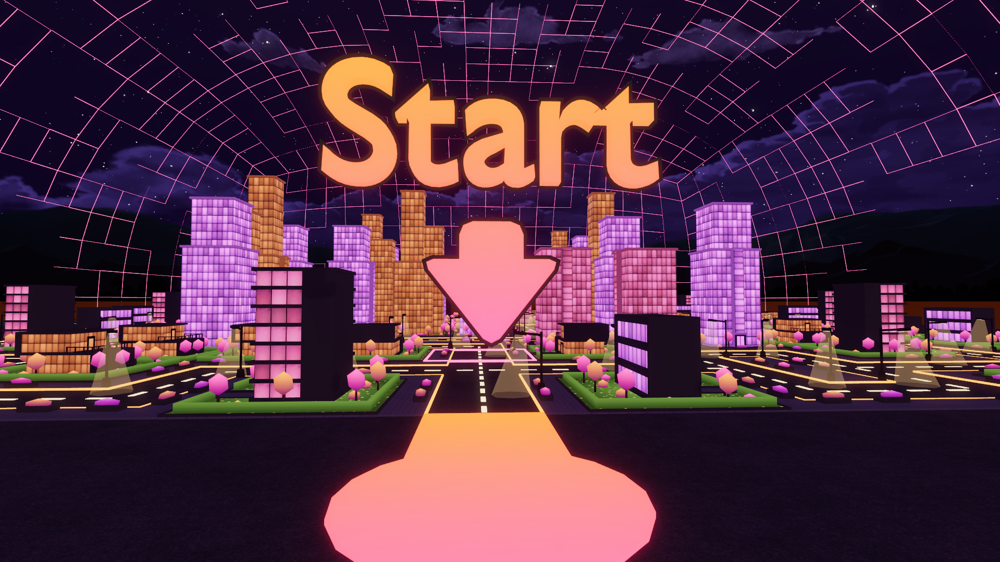
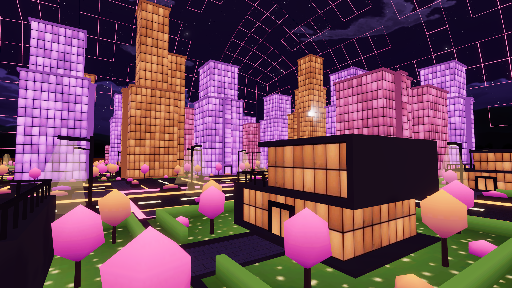
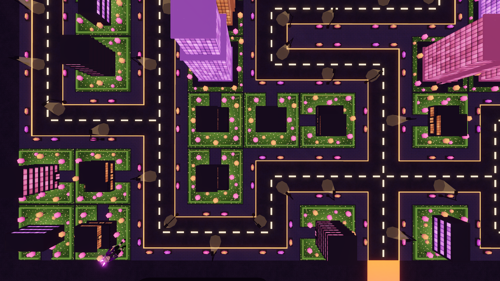
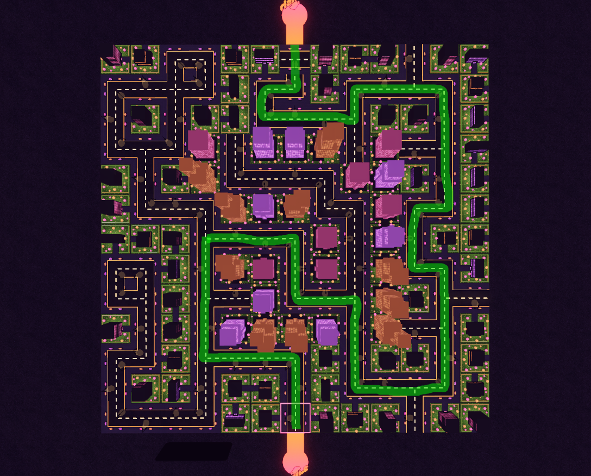
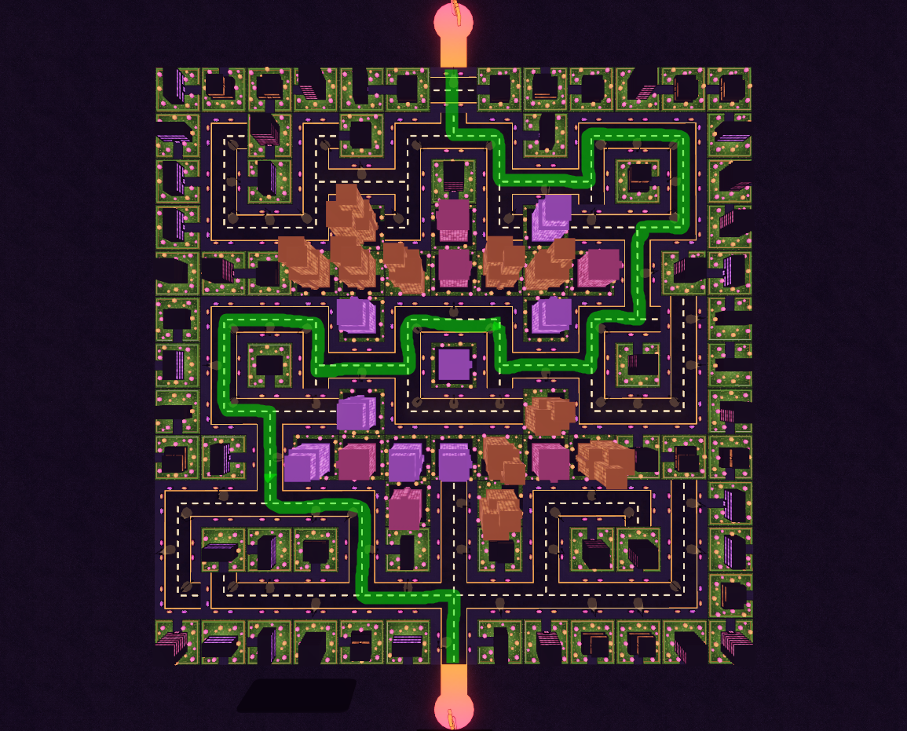
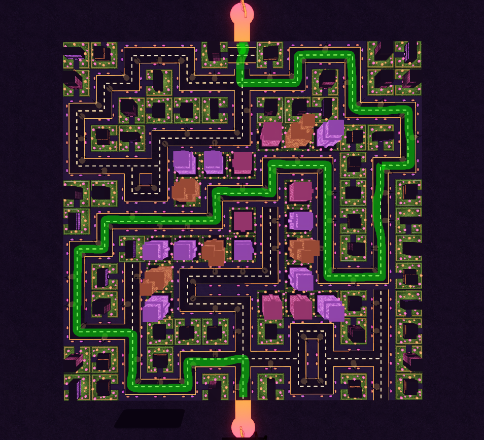
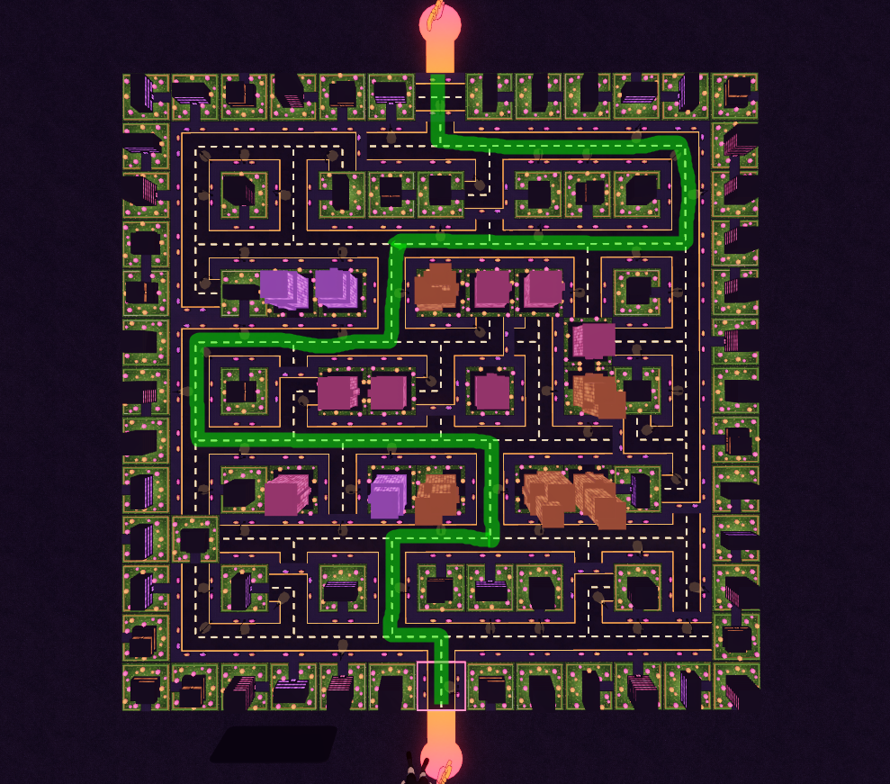
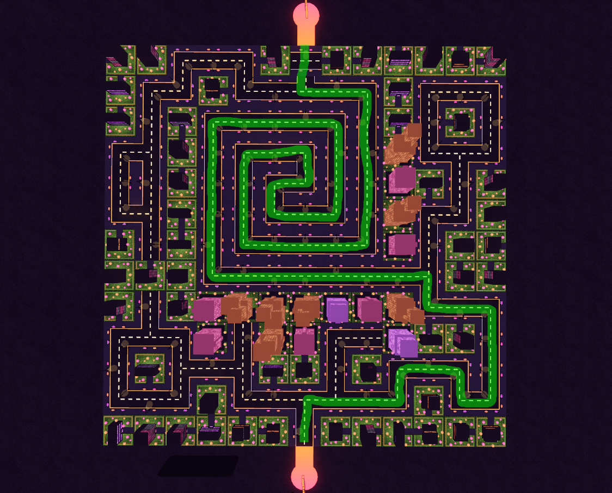

# Project description

This project contains a game created for Decentraland Game Jam 2024 based on the theme 'Neon Fairground'. It is written using Decentraland SDK version 7. All of the code and models have been created during the contest period. Scene doesn't connect to external servers.

Currently deployed under Decentraland name `Nightlife`. Follow [this link](https://decentraland.org/play/?realm=Nightlife.dcl.eth) or type in the Decentraland chatbox `/changerealm Nightlife.dcl.eth` to visit the scene.

In this puzzle game, players must use their logic and problem-solving skills to create a continuous road path within a city by rotating various road tiles. The game board consists of a 13x13 grid, totaling 169 tiles. Besides the essential road tiles, the grid also features decorative elements such as office buildings and homes. Players progress through 5 increasingly challenging levels, the maps for all 5 levels are hard-coded and each map contains a single unique path from start to finish.





## Game maps

In case if you get stuck in some level, here are the correct paths:

### Level 1



### Level 2



### Level 3



### Level 4



### Level 5



## Resources

Resources used in this project:

- 'Click' sound from [Decentraland smart items repo](https://github.com/decentraland/smart-items/blob/master/button_genesis_blue/sounds/click.mp3)

- Pavement, asphalt and building facade textures from [ambientCG](https://ambientcg.com/). All ambientCG assets are provided under the [Creative Commons CC0 1.0 Universal License](https://docs.ambientcg.com/license/)

- [glTF Pipeline tool](https://github.com/CesiumGS/gltf-pipeline) used for saving 3D model textures as separate files

## Try it out

**Previewing the scene**

1. Download this repository.

2. Install the [Decentraland Editor](https://docs.decentraland.org/creator/development-guide/sdk7/editor/)

3. Open a Visual Studio Code window on this scene's root folder. Not on the root folder of the whole repo, but instead on this sub-folder that belongs to the scene.

4. Open the Decentraland Editor tab, and press **Run Scene**

Alternatively, you can use the command line. Inside this scene root directory run:

```
npm i
npm run start
```

## Copyright info

This scene is protected with a standard Apache 2 licence. See the terms and conditions in the [LICENSE](/LICENSE) file.
